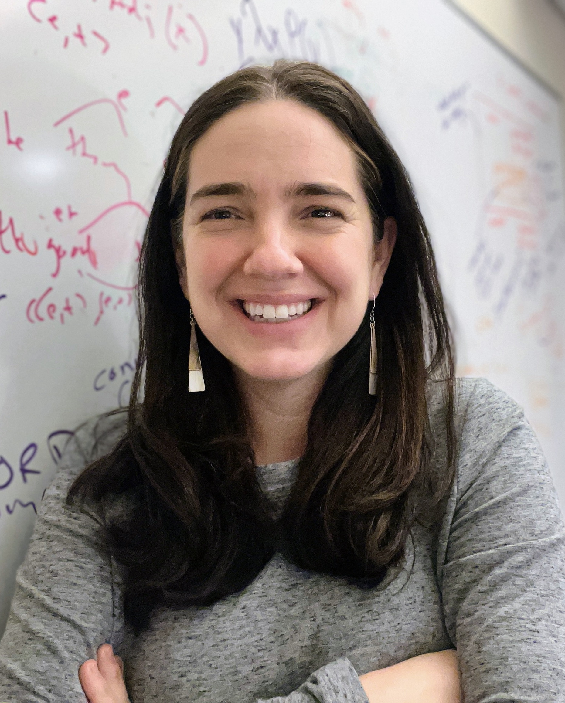
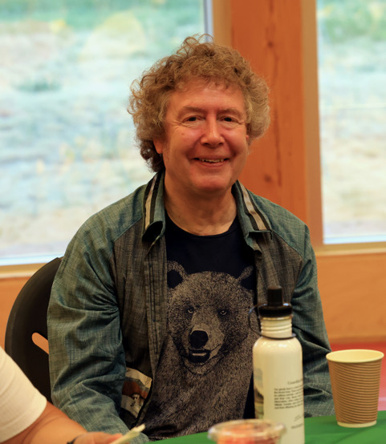
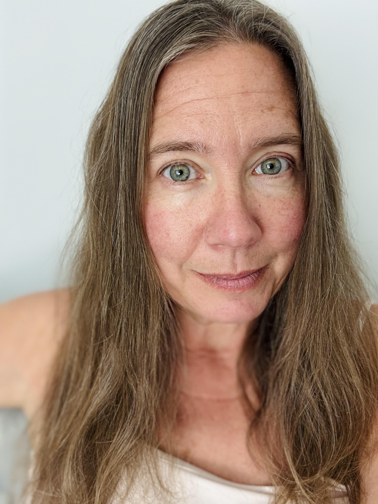

---
eleventyNavigation:
  key: Invited Speakers
  order: 1
---

# Invited Speakers

## [Kathryn Davidson (Harvard)](https://linguistics.fas.harvard.edu/people/kathryn-davidson)
<!-- Dr. Davidson's keynote, [title], will be at [time] in [room] on [date] -->
More info about Dr. Davidson's talk to come!

<!--  -->

Kathryn Davidson (PhD University of California, San Diego) is a Professor of Linguistics at Harvard University. Her research areas include experimental semantics, formal semantic and pragmatic theory, and connections between semantics and cognitive science. At Harvard Linguistics she is the current Director of Undergraduate Studies and directs the Meaning and Modality lab, which focuses on collecting data from a wide variety of spoken and signed languages to address research questions in semantics and its related fields.

## [Henry Davis (UBC)](https://linguistics.ubc.ca/profile/henry-davis/)  
<!-- Dr. Davis's keynote, [title], will be at [time] in [room] on [date] -->
More info about Dr. Davis's talk to come!

<!--  -->

Henry Davis is a Professor of Linguistics at UBC. For the last thirty or so years, his research has focused on the languages of the Pacific Northwest of North America, including those of the Salish, Tsimshianic and Wakashan families. He has worked  on a multitude of topic in syntax and its interfaces, including syntactic categories, configurationally, argument structure, agreement, clitics, binding, quantification, aspect, and modality,  He has also been heavily involved in language documentation and education initiatives, particularly for the Interior Salish language St’át’imcets (Lillooet): this work includes dictionary compilation, the transcription and translation of texts, and the development of grammatical material accessible to language learners and teachers as well as linguists.

## [Meghan Sumner (Stanford)](https://profiles.stanford.edu/meghan-sumner)
<!-- Dr. Sumner's keynote, [title], will be at [time] in [room] on [date] -->
More info about Dr. Sumner's talk to come!

<!--  -->

Meghan Sumner received her PhD in Linguistics at Stony Brook University. After completing her PhD, she was an NIH NRSA Postdoctoral Fellow in Cognitive Psychology. She has been at Stanford University since 2007, where she is now an Associate Professor of Linguistics and the Director of the Stanford Phonetics Lab, where she investigates variation and spoken language understanding.

Meghan’s research sits at the intersection of acoustic phonetics, language use and variation, social meaning, and cognitive psychology. She investigates attention, perception, recognition, memory, and comprehension within and across individuals, groups, and languages, aiming to understand how different components of spoken language understanding work together. She and her students are testing the predictions of and hope to contribute to the development of a dynamic adaptive socially-anchored model of spoken language understanding. For the past twenty years, her work has focused on diverse talker and listener populations, drawing on variation to address issues in linguistics and psychology related to representation, asymmetries in memory, social effects in spoken language recognition, familiarity, experience, and categorization.  

She is currently a Stanford Impact Labs Design Fellow, working with public institutions and advocacy groups to apply language-based social science methods to increase protections for children living with domestic violence.  

